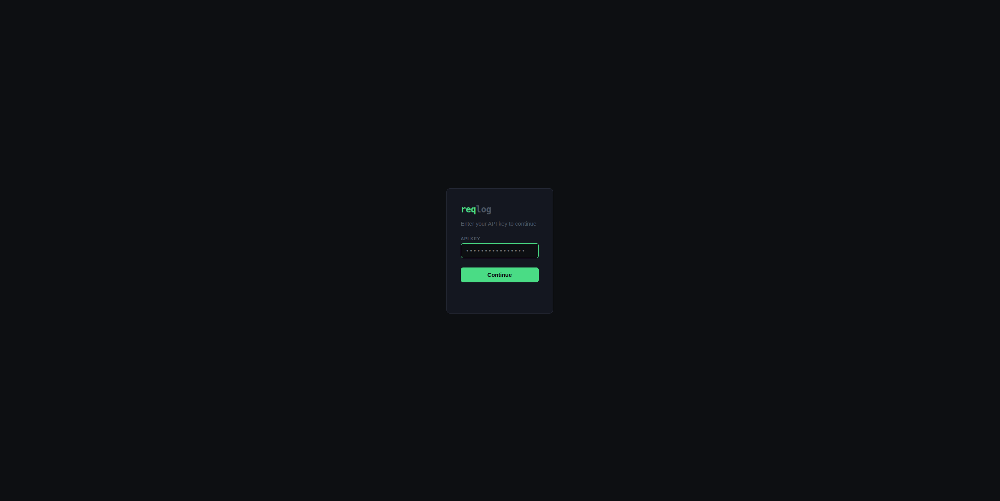
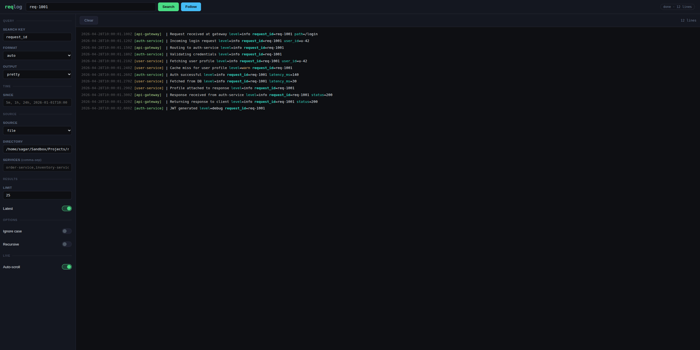
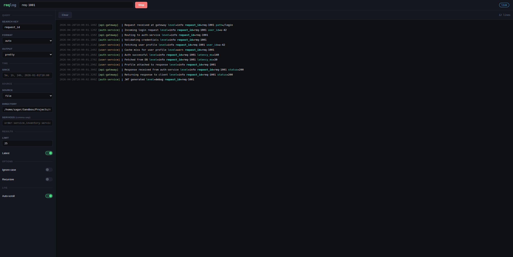

# Reqlog UI

A lightweight web UI for **[reqlog](https://github.com/SagarMaheshwary/reqlog)** — search and trace logs directly from your browser.

It’s designed for small teams that want **quick visibility into logs without SSH access**.

## Screenshots

<div style="display: flex; gap: 12px; flex-wrap: wrap;">

  
  
  

</div>

## Features

- Search logs from browser (same power as reqlog CLI)
- Live log streaming via SSE
- API key-based authentication
- Minimal setup (single binary)
- Built with Go — lightweight and fast
- Concurrency limits for safe multi-user usage

## Installation

### Go Install

```bash
go install github.com/sagarmaheshwary/reqlog-ui/cmd/reqlog-ui@latest
```

### macOS / Linux

```bash
curl -sSL https://raw.githubusercontent.com/sagarmaheshwary/reqlog-ui/master/install.sh | bash
```

- Auto-detects OS/arch
- Installs latest version
- Installs to `/usr/local/bin`

Verify:

```bash
reqlog-ui --version
```

### Windows

Download from:
[https://github.com/sagarmaheshwary/reqlog-ui/releases](https://github.com/sagarmaheshwary/reqlog-ui/releases)

Then:

- unzip
- add to `PATH`

Verify:

```bash
reqlog-ui --version
```

## Usage

### 1. Start the server

```bash
HTTP_AUTH_API_KEY=your-secret-key \
REQLOG_BINARY_PATH=/usr/local/bin/reqlog \
reqlog-ui
```

Generate a secure API key using:

```bash
openssl rand -hex 32
```

### 2. Open in browser

```
http://localhost:4000
```

### 3. Authenticate

- Enter your API key
- Start searching logs

## How it works

```text
Browser → reqlog-ui → reqlog CLI → log files/containers
```

- `reqlog-ui` does **not process logs itself**
- all filtering/searching is handled by `reqlog`
- UI simply provides a browser interface

## Configuration

| Variable                      | Description                                                    | Default                  |
| ----------------------------- | -------------------------------------------------------------- | ------------------------ |
| `HTTP_AUTH_API_KEY`           | API key required to access the UI login                        | **required**             |
| `HTTP_AUTH_JWT_SECRET`        | JWT secret key for HTTP-only auth cookie                       | **required**             |
| `HTTP_SERVER_URL`             | Address the server listens on                                  | `localhost:4000`         |
| `REQLOG_BINARY_PATH`          | Path to reqlog binary                                          | `reqlog`                 |
| `REQLOG_EXECUTION_TIMEOUT`    | Max time allowed for log search execution                      | `15m`                    |
| `REQLOG_MAX_LINES`            | Max number of log lines returned per search                    | `5000`                   |
| `REQLOG_SEARCH_CONCURRENCY`   | Max concurrent search requests                                 | `5`                      |
| `REQLOG_STREAM_CONCURRENCY`   | Max concurrent live stream connections                         | `5`                      |
| `REQLOG_ALLOWED_DIRECTORIES`  | Allowed log directories shown in UI (`name:path` comma format) | `reqlog:/var/log/reqlog` |
| `REQLOG_DOCKER_SERVICES_MODE` | Container source mode: `auto` or `manual`                      | `auto`                   |
| `REQLOG_DOCKER_SERVICES`      | Container names for manual mode (`comma-separated`)            | empty                    |
| `ENV_FILE`                    | `.env` path                                                    | `.env`                   |
| `DISABLE_PRETTY_LOGS`         | Disable pretty logs and output raw JSON                        | `0`                      |

### Directory Configuration

Predefine searchable log directories shown in the UI:

```env
REQLOG_ALLOWED_DIRECTORIES=reqlog:/var/log/reqlog,app:/path/to/app/logs
```

This limits searchable locations and avoids arbitrary filesystem access.

### Docker Services Configuration

#### Auto mode (recommended)

Automatically loads running containers:

```env
REQLOG_DOCKER_SERVICES_MODE=auto
```

Uses:

```bash
docker ps --format '{{.Names}}'
```

#### Manual mode

Provide a predefined list of allowed services:

```env
REQLOG_DOCKER_SERVICES_MODE=manual
REQLOG_DOCKER_SERVICES=order-service,inventory-service,payment-service
```

> See `.env.example` for all available environment variables.

> Concurrency limits help prevent resource exhaustion when multiple users are searching or streaming logs simultaneously.  
> When limits are exceeded, search requests return HTTP 429 and stream requests emit an SSE error event.

## Security Notes

- Login is performed using an API key, which is exchanged for a JWT-based HTTP-only cookie session
- SSE (live streaming) uses cookie-based authentication instead of query parameters
- Input validation is applied before executing CLI commands

> ⚠️ Intended for use in trusted/internal environments (e.g. behind VPN or private networks).
> Logs may contain sensitive information, so avoid exposing this tool publicly without proper safeguards such as authentication, HTTPS, or network restrictions.

## Version Compatibility

| reqlog-ui      | reqlog |
| -------------- | ------ |
| v0.2.0         | v0.2.2 |
| v0.3.0, v0.3.1 | v0.6.0 |
| v0.4.0         | v0.7.1 |
| v0.5.0         | v0.9.0 |

> Ensure compatible versions for correct behavior.

## Support & Contributions

If you find this project useful, consider giving it a ⭐ — it helps others discover it.

Feedback, contributions, and discussions are very welcome.
Feel free to open an issue or submit a PR.

## Development Notes

The frontend (HTML/CSS) was mostly developed with AI assistance to speed up UI implementation and iteration.

All backend functionality—including request handling, authentication, validation, CLI integration, and security-related logic—is implemented and reviewed manually. AI-generated frontend code is also reviewed and integrated before use.

## License

MIT
